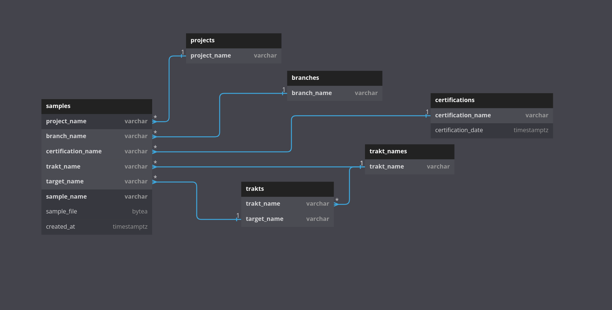

# SamplesSubsystem

## Описание
Данный репозиторий позволяет получать и отправлять сэмплы в базу данных Postgres
или монтировать в выбранной директории. При несложном интерфейсе позволяет
упростить работу с сэмплами, полученными во время фаззинга.

## Схема
Схема базы данных в PostgreSQL, используемая в проекте.



## Создание базы данных

Поменяйте в вашем `pg_hba.conf` в строке

```
local   all             all                                     peer
```
`peer` на `md5`

далее от имени пользователя postgres

1. `createuser -P sample-storage-user`

2. `createdb -O sample-storage-user sample-storage`

3. `psql -U sample-storage-user -d sample-storage -a -f sql/SampleSubsystem.sql`

## Зависимости
Для работы скриптов необходим интерпретатор Perl5 и PostgreSQL.
Также необходимо установить Perl-пакет Postgres DBI:

`apt install libdbd-pg-perl`

Чтобы проверить наличие пакета на Debian-системах используйте:

`dpkg --get-selections | grep "^libdb[id]-`

Также для использования fusermount необходимо поставить её пакет:

`apt install fuse`

## Использование

Имеется несколько сценариев использования пакета. Вы можете:

0. Запросить помощь в использовании:

`test.pl --help` or `script.pl -h`


1. Получить сэмпл по конкретным значениям полей из базы:

`test.pl JSON_CONFIG_PATH get PROJECT_NAME CERTIFICATION_NAME BRANCH_NAME TRAKT_NAME TARGET_NAME SAMPLE_NAME`

3. Отправить желаемый сэмпл в базу:

`test.pl JSON_CONFIG_PATH put SAMPLE_PATH PROJECT_NAME CERTIFICATION_NAME BRANCH_NAME TRAKT_NAME TARGET_NAME SAMPLE_NAME`

6. Добавиль/заменить сэмплы указанного запуска на сэмплы из директории PATH:

`test.pl JSON_CONFIG_PATH upsert-samples -p PROJECT_NAME -c CERTIFICATION_NAME -b BRANCH_NAME --trakt=TRAKT_NAME --target=TARGET_NAME PATH/*`

7. Получить все сэмплы для заданной цели по указанному пути:

`test.pl JSON_CONFIG_PATH get-samples -p PROJECT_NAME -c CERTIFICATION_NAME -b BRANCH_NAME --trakt=TRAKT_NAME --target=TARGET_NAME PATH`

8. Создать запись в таблице проектов:
`test.pl JSON_CONFIG_PATH create-project PROJECT_NAME`

9. Создать запись в таблице сертификаций:
`test.pl JSON_CONFIG_PATH create-cert CERTIFICATION_NAME [CERTIFICATION_DATE]`

10. Создать запись в таблице веток:
`test.pl JSON_CONFIG_PATH create-branch BRANCH_NAME`

11. Создать запись в таблице имён трактов:
`test.pl JSON_CONFIG_PATH create-trakt TRAKT_NAME`

13. Добавить цель:
`test.pl JSON_CONFIG_PATH create-target -p PROJECT_NAME --trakt=TRAKT_NAME TARGET_NAME`

14. Удалить запись в таблице проектов:
`test.pl JSON_CONFIG_PATH delete-project PROJECT_NAME`

15. Удалить запись в таблице сертификаций:
`test.pl JSON_CONFIG_PATH delete-cert CERTIFICATION_NAME`

16. Удалить запись в таблице веток:
`test.pl JSON_CONFIG_PATH delete-branch BRANCH_NAME`

17. Удалить запись в таблице имён трактов:
`test.pl JSON_CONFIG_PATH delete-trakt TRAKT_NAME`

18. Удалить запись в таблице имён целей:
`test.pl JSON_CONFIG_PATH delete-target TARGET_NAME`

19. Удалить  запись в таблице трактов:
`test.pl JSON_CONFIG_PATH delete-trakt-target TRAKT_NAME TARGET_NAME`

20. Получить имя последней сертификации, для которой есть результаты:
`test.pl JSON_CONFIG_PATH latest-cert PROJECT_NAME BRANCH_NAME TRAKT_NAME TARGET_NAME`

21. Получить имена последней сертификации и ветки, для которых есть результаты:
`test.pl JSON_CONFIG_PATH latest-cert-branch PROJECT_NAME TRAKT_NAME TARGET_NAME`

22. Получить последние добавленные результаты для сертификации:
`test.pl JSON_CONFIG_PATH latest-cert-samples PROJECT_NAME BRANCH_NAME TRAKT_NAME TARGET_NAME`

23. Получить списко сертификаций
`test.pl JSON_CONFIG_PATH list-certs`

## Авторы
Ян Ильясов, Николай Шаплов
